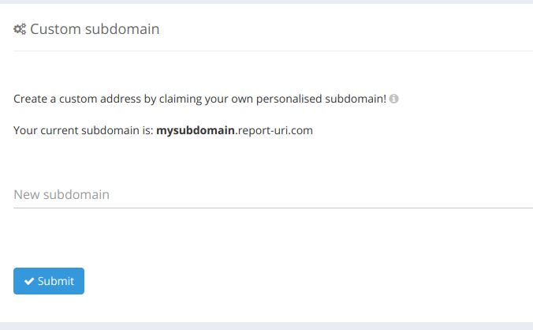
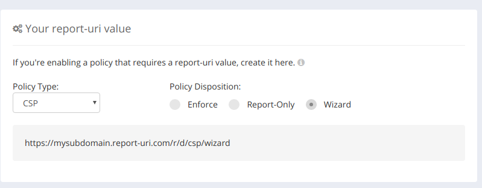
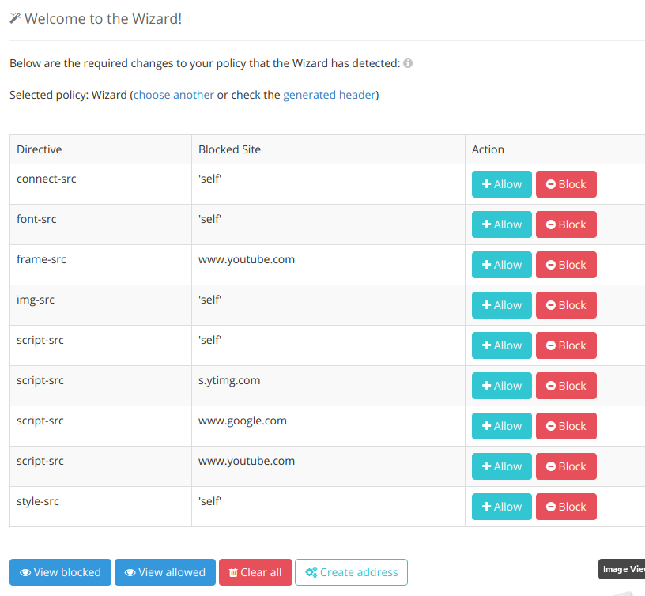

# magento-content-security-policy

Allows the defining and refining of Content-Security-Policy Headers and sets them on requests to the front end of the site. Once the policy has been tuned it is set in a file and can only be altered with acess to the file system.

## Recommended Procedure to Create The Header

1. Install the module. By default this will not set a header

2. Login / Create an account at https://report-uri.com and create a subdomain

3. Generate a wizard url for you subdomain

4. Add the wizard-url together with a restrictive header to the modules config

5. View and allow urls in report-uri.com wizard and then generate a policy

6. Add the generated policy to the modules config together with a ReportOnly report-uri

7. Repeat steps 5-6 until happy the policy is not reporting violations that are false positives

8. Cut and paste the policy from the config into a file and upload to etc/csp.txt within the module

## F.A.Q

### Why do I need to upload / commit my policy as a file?

This is done for security. Most attacks against Magento occur by an attacker getting accces to the admin backend of the site. Once installed and configured such an attacker would not be able to disable this module unless they have access to the file system.

### Can I set a permanent policy in the config section?

No this will only ever allow ReportOnly headers

### Do I have to use report-uri.com to generate my policy?

No you can set the report-uri to anything you like or not have one. However, it is recomended that you use a report-uri when developing a policy as otherwise it may kill legitimate behaviour and you may not notice.
