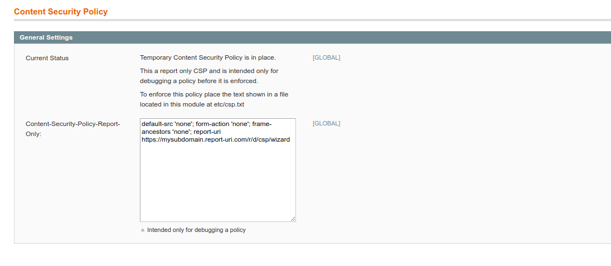

# magento-content-security-policy

Allows the defining and refining of Content-Security-Policy Headers and sets them on requests to the front end of the site. Once the policy has been tuned it is set in a file and can only be altered with acess to the file system.

## Recommended Procedure to Create The Header

1. Install the module. By default this will not set a header
2. Login / Create an account at https://report-uri.com and create a subdomain

3. Generate a wizard url for you subdomain

4. Add the wizard-url together with a restrictive header to the modules config

5. View and allow urls in report-uri.com wizard and then generate a policy

6. Add the generated policy to the modules config together with a ReportOnly repot-uri
7. Repeat steps 5-6 until happy the policy is not reporting violations that are false positives
8. Cut and paste the policy from the config into a file and upload to etc/csp.txt within the module
